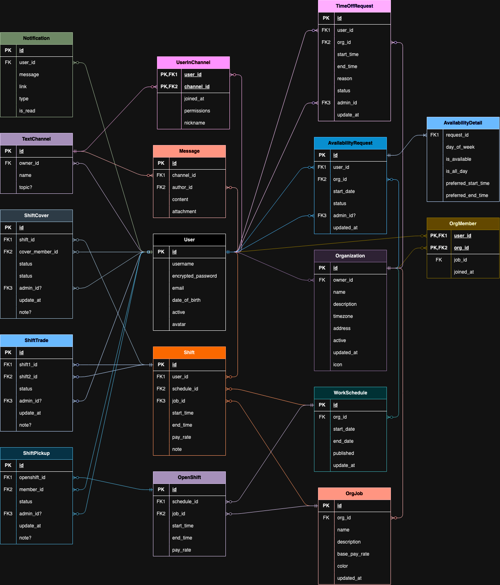

# WorkBase - Workplace Scheduler

## Introduction

**WorkBase** is a comprehensive solution designed to streamline workplace scheduling. This project aims to deliver a simple and intuitive platform for managing workplace tasks, schedules, and resources efficiently.

## Technology Stack

### Backend

- **Language**: Rust
  - **Database Interaction**: Utilizing the `mysql` crate to establish and manage connections with the MySQL database.
  - **API Framework**: Planning to develop the backend API using `axum` and `tokio` to handle asynchronous operations and provide a high-performance web server.
  - **Database Queries**: Emphasis on using Raw SQL queries for database interactions to ensure precise and efficient data manipulation.

### Frontend

- **Languages and Libraries**: TypeScript and React
- **UI Framework**: Material-UI (MUI)
- **Styling**: StyleX, a utility-first CSS framework

## Project Structure

### Backend (Rust)

- **SQL Queries**: I am focused on writing Raw SQL queries, ensuring maximum control over database operations and performance optimization.
- **Database Interaction**: The `mysql` crate is central to our database operations, providing the necessary tools to connect, query, and manage the MySQL database.
- **API Development**: Using `axum` for creating backend API. `tokio` will be employed for handling asynchronous tasks, enhancing the performance and scalability of our backend services.

### Frontend (React, TypeScript, MUI, StyleX)

- **React & TypeScript**: The combination of React and TypeScript will offer a robust and type-safe development experience, leading to more maintainable and scalable front-end code.
- **MUI**: Material-UI will be used for designing a sleek and responsive user interface, providing a collection of pre-made components that align with Material Design principles.
- **StyleX**: This will aid in creating custom and efficient CSS styles, allowing for a more tailored and performance-oriented user experience.
